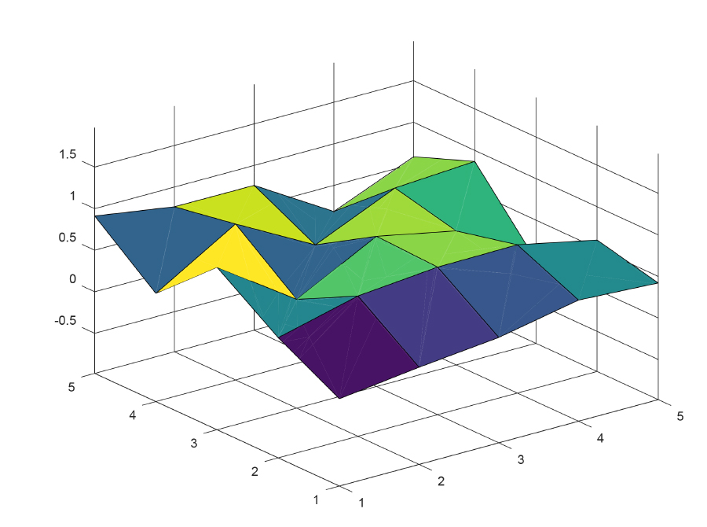
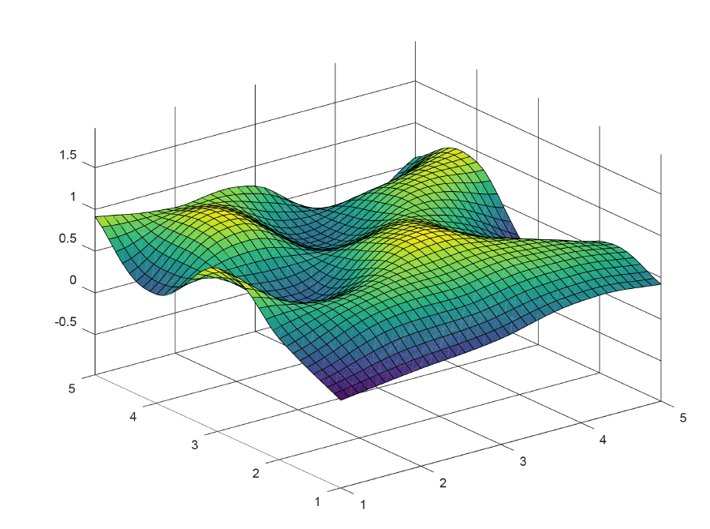

# Plane interpolation
A GNU Octave program that interpolates a 3D plane and displays the result. It was created as a homework assignment for my mathematical modelling class.

## How to use it
Run the `tester.m` file. By default, it generates a random 5x5 matrix as the input. You can change that by modifying the matrix `V`. To change the interpolation accuracy, modify the `len` variable.

## Example
* Input:

* Output for `len = 10`:

